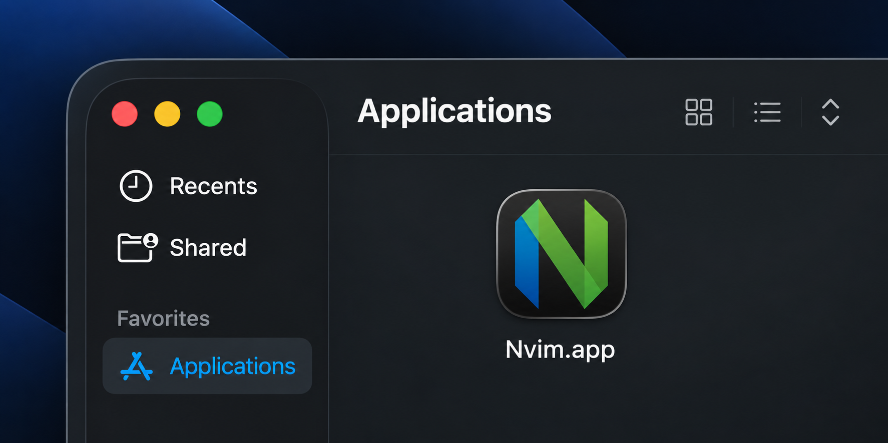

# Nvim iTerm2 App

A small macOS launcher that opens **Neovim in iTerm2 from Spotlight**.

Press `⌘ Space`, search for `Nvim`, and hit Enter.

When you quit Neovim with `:q`, the iTerm2 window closes with it.

<p align="center">
  
</p>

## Installation

Recommended: build and install locally.

```sh
brew install neovim
brew install --cask iterm2

git clone https://github.com/philippwallrafen/nvim-iterm2-app.git
cd nvim-iterm2-app
./nvim-app.sh install
```

The script builds `Nvim.app`, signs it locally, installs it to `/Applications`, and registers it with macOS.

Then launch it with:

```text
⌘ Space → Nvim → Enter
```

macOS may ask for permission to let Nvim control iTerm2 on first launch. Allow it.

## Other commands

```sh
./nvim-app.sh build
./nvim-app.sh package
```

- `build` creates `dist/Nvim.app`
- `package` creates `dist/Nvim.app.zip`

## Prebuilt release

You can also download `Nvim.app.zip` from the latest GitHub Release, extract it, and move `Nvim.app` to `/Applications`.

The prebuilt release is ad-hoc signed, not Apple-notarized. macOS may require **right-click → Open** on first launch.

## Requirements

- macOS
- [Neovim](https://neovim.io/)
- [iTerm2](https://iterm2.com/)

## How it works

`Nvim.app` is a small AppleScript launcher. It opens Neovim in iTerm2 using `exec nvim`, so quitting Neovim ends that terminal session and closes the window.

Neovim itself is not bundled.

## Disclaimer

This is an unofficial project and is not affiliated with or endorsed by Neovim or iTerm2.

The app icon is derived from the official [Neovim logo assets](https://github.com/neovim/neovim.github.io/tree/master/static/logos).

## License

MIT
